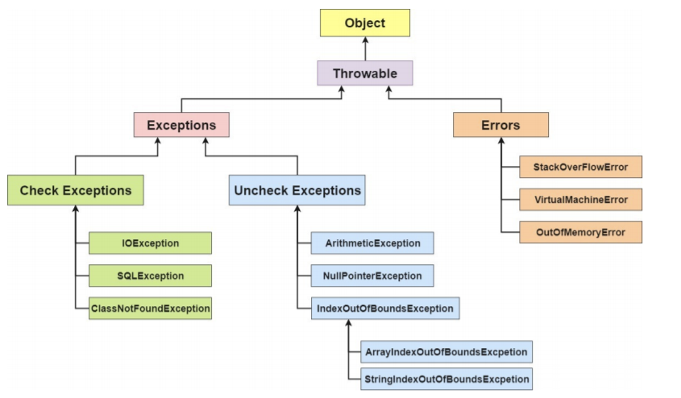

# Java基础

## 泛型

## Q&A

### Java语言特点

- 特点：

  （1）面向对象（抽象、封装、继承、多态）

  （2）一次编译，到处运行（JVM实现）

  （3）支持多线程（区别于C++）

  （4）编译与解释并存（先由编译器将Java代码编译成字节码文件（.class文件），然后JVM根据具体的操作系统解释成具体的可执行机器码）

- JVM：

  ​        传统方式上.class->机器码这一步，是由JVM类加载器加载字节码文件，然后通过解释器逐行解释执行，效率较低。

  ​		而有些方法和代码块是经常执行的，被称为热点代码。于是引进了JIT编译器，JIT属于运行时编译，即完成第一次编译后，所对应的机器码会被保存下来，下次不需重新编译。

- JDK与JRE：

  ​		JDK（Java Deveopment Kit）包括JRE（Java Runtime Environment），是功能齐全的Java SDK，还含有编译器（javac）和工具（javadoc、jdb），能够创建和编译程序。

  ​		JRE能运行已编译Java程序，是运行环境。

- Oracle JDK和Open JDK：

  ​		OpenJDK是一个参考模型，并完全开源，但Oracle JDK是Open JDK的一个实现，有更多的类并且修复了一些错误，建议使用Oracle JDK。

### 基本数据类型


​		**注意：**

```
float f1 = 3.0;  //错误
float f2 = 3;   //正确
float f3 = 3.0f;    //正确

long lo = 3L;   //  long型需要加上'L'或'l'，否则会被当做整型处理
```

- **自动装箱**：自动将基本数据类型转换为包装器类型。
- **自动拆箱**：自动将包装器类型转换为基本数据类型。
- **实现过程**：装箱过程通过调用包装器的ValueOf方法实现，拆箱过程通过调用包装器的xxxValue方法实现。

​        **8中基本类型的包装类与常量池**:Java基本类型的包装类都实现了常量池技术，即Byte,Short,Integer,Long,Character,Booleaṉ；前面4中包装类默认创建了数值[-128,127]的相应类型的缓存数据，Character创建了数值在[0,127]范围的缓存数据，Boolean直接返回true或false。如果超出对应范围仍然会去创建新的对象。两种浮点数类型的包装类Float、Double并没有实现常量池技术。

```
public static Boolean valueOf(boolean b) {
        return (b ? TRUE : FALSE);
    }
```

```
private static class CharacterCache {
        private CharacterCache(){}

        static final Character cache[] = new Character[127 + 1];

        static {
            for (int i = 0; i < cache.length; i++)
                cache[i] = new Character((char)i);
        }
    }
```

​		这就是为什么Integer a=1走缓存，而 Integer b=333不走缓存，故

```
Integer i1 = 100;
Integer i2 = 100;
System.out.println(i1==i2);    //true

Integer i3 = 200;
Integer i4 = 200;
System.out.println(i3==i4);    //false

Integer i5 = 44;
Integer i6 = new Integer(44);
System.out.println(i5==i6);   //false,此时new创建了新的对象

Double i7 = 1.2;
Double i8 = 1.2;
System.out.println(i7==i8);    //false
```

**为什么将缓存设置在[-128,127]?**

​		**Integer缓存源码：**

```
public static Integer valueOf(int i) {
        if (i >= IntegerCache.low && i <= IntegerCache.high)
            return IntegerCache.cache[i + (-IntegerCache.low)];
        return new Integer(i);
    }
```

​	案例：

```
Integer i1 = 40;
Integer i2 = 40;
Integer i3 = 0;
Integer i4 = new Integer(40);
Integer i5 = new Integer(40);
Integer i6 = new Integer(0);

System.out.println("i1=i2   "+(i1==i2));  //true
System.out.println("i1=i2+i3   "+(i1==i2+i3));  //true
System.out.println("i1=i4   "+(i1==i4));  //false
System.out.println("i4=i5   "+(i4==i5));  //false
System.out.println("i4=i5+i6   "+(i4==i5+i6));  //true
System.out.println("40=i5+i6   "+(40==i5+i6));  //true
```

​		因为i4==i5+i6，因为+这个操作符不适用Integer对象，i5和i6会进行自动拆箱，进行数值相加，即i4==40，而Interger无法与数值比较，i4会进行自动拆箱转为int值40，最终比较40==40.

​		**当 "=="运算符的两个操作数都是 包装器类型的引用，则是比较指向的是否是同一个对象，而如果其中有一个操作数是表达式（即包含算术运算）则比较的是数值（即会触发自动拆箱的过程）。**

```
public class Main {
    public static void main(String[] args) {
         
        Integer a = 1;
        Integer b = 2;
        Integer c = 3;
        Integer d = 3;
        Integer e = 321;
        Integer f = 321;
        Long g = 3L;
        Long h = 2L;
         
        System.out.println(c==d);    //true
        System.out.println(e==f);    //false
        System.out.println(c==(a+b));   //true
        System.out.println(c.equals(a+b));  //true
        System.out.println(g==(a+b));   //true
        System.out.println(g.equals(a+b));  //false
        System.out.println(g.equals(a+h));   //true
    }
}
```

​		倒数第一个和倒数第二个注意：数值是int类型的，装箱过程调用的是Integer.valueOf；如果是long类型的，装箱调用的Long.valueOf方法

### Java关键字


- native:用来声明一个方法是由与计算机相关的语言（如C/C++语言）实现的
- strictfp：用来声明FP_strict（单精度或双精度浮点型）表达式遵循IEEE 754算术规范
- transient:表示不用序列化的成员域
- volatile：表明两个或者多个变量必须同步地发生变化

### Java泛型

​		泛型在JDK1.5引入，提供了编译时类型安全检测机制，即在编译时能够检测到非法的类型，泛型的本质是参数化类型。在没有泛型时，往往需要对类型Object进行引用进而实现参数的"任意化"，而这种转换需要强制类型转换，即需要开发者对实际参数类型可以预知。而对于强制类型转换错误的情况，编译器可能不提示错误，而报运行时异常，是一个安全隐患。

​		Java的泛型是伪泛型，因为在编译期，所有的泛型信息都会被擦掉，称为**类型擦除**，泛型一般有三种使用方式：泛型类、泛型接口、泛型方法。

​		**通配符**

- ？：表示不确定的java类型
- T（type）：表示一个具体的java类型
- K V（key value）：分别表示java键值中的key Value
- E（element）：代表Element

​		**上界通配符<? extends E>**：用extends关键字声明，表示参数化的类型可能是所指定的类型，或者是此类型的子类。

​		（1）如果传入的类型不是E或者E的子类，编译不成功

​		（2）泛型中可以使用E的方法，要不然还得强转成E才能使用

> 类型参数列表中如果有多个类型参数上限，用逗号分开

​        **下界通配符<? super E>**:用super进行声明，表示参数化的类型可能是所指定的类型，或者是此类型的父类型，直至Object

```
private <T> void test(List<? super T> dst, List<T> src){
    for (T t : src) {
        dst.add(t);
    }
}

public static void main(String[] args) {
    List<Dog> dogs = new ArrayList<>();
    List<Animal> animals = new ArrayList<>();
    new Test3().test(animals,dogs);
}
// Dog 是 Animal 的子类
class Dog extends Animal {

}
```

​		dst 类型 “大于等于” src 的类型，这里的“大于等于”是指 dst 表示的范围比 src 要大，因此装得下 dst 的容器也就能装 src 。

​		**？和 T 的区别**

​		T是一个确定的类型，通常用于泛型类和泛型方法的定义，？是一个不确定的类型，通常用于泛型方法的调用代码和形参，不能用于定义类和泛型方法。

​		**区别1：通过T来确保泛型参数的一致性**

​		**区别2：类型参数可以多重限定而通配符不行**

```
public class MultiLimit implements MultiLimitInterfaceA,MultiLimitInterfaceB{
	public static<T extends MultiLimitInterfaceA & MultiLimitInterfaceB> void test(T t){
	
	}
}

interface MultiLimitInterfaceA{}

interface MultiLimitInterfaceB{}
```

​		**区别3：通配符可以使用超类限定而类型参数不行**

​		类型参数 T 只具有 一种 类型限定方式：

```
T extends A
```

​		但是通配符?可以进行两种限定

```
？extends A
? super A
```

​		**Class<T>和Class<?>的区别**

​			常见的是在反射场景下的使用，如：

```
// 通过反射的方式生成  multiLimit 
// 对象，这里比较明显的是，我们需要使用强制类型转换
MultiLimit multiLimit = (MultiLimit)
Class.forName("com.glmapper.bridge.boot.generic.MultiLimit").newInstance();
```

​		对于上述代码，在运行期，如果反射的类型不是 MultiLimit 类，那么一定会报 java.lang.ClassCastException 错误。

​		对于这种情况，则可以使用下面的代码来代替，使得在在编译期就能直接 检查到类型的问题：

```
public class Test3{
	public static <T> T createInstance(class<T> clazz) throws IllegalAccessException,InstantiationException{
		return clazz.newInstance();
	}
	
	public static void main throws IllegalAccessException,InstantiationException{
		A a = createInstance(A.class);
		B b = createInstance(B.class);
	}
}

class A{}
class B{}
```

​		Class<T>在实例化的时候，T要替换为具体类，Class<?>它是个通配符型，?可以表示任何类型，所以主要用于声明时的限制情况，比如：

```
public Class<?> clazz;    // 可以

public Class<T> clazzT;  // 不可以，因为 T 需要指定类型
```

​		所以当不知道定声明什么类型的Class的时候可以定义一个Class<?>

```
public class Test3{
	public Class<?> clazz;   //正确
	public Class<T> clazzT;  //报错
}
```

​		如果想`public Class<T> clazzT;` 这样的话，就必须让当前的类也指定 T 

```
public class Test3<T> {
    public Class<?> clazz;
    
    public Class<T> clazzT;// 不会报错

```

### ==与equals()

​		==：判断两个对象的地址是否相等，即是否为同一个对象。（**基本数据类型比较的是值，引用数据类型比较的是内存地址**）。

> 并且由于Java只有值传递，所以，本质上"=="比较的都是值，只不过引用类型存的值是对象的地址

​		**equals()**:也是比较两个对象是否相等，它不能用于比较基本数据类型的变量。equals()方法存在于Object类中 ，而Object类是所有类的直接或间接父类。

​		Object类equals()方法：

```
public boolean equals(Object obj) {
        return (this == obj);
    }
```

​		当使用equals()方法比较时，若类没有重写equals()方法，则相当于通过"=="来比较这两个对象，默认使用Object类的equals()方法。若重写了equals()方法，则一般比较对象的内容是否相等。

> String类中重写了equals()方法，比较值是否相等，当创建String类型的对象时，JVM会在常量池中查找是否有存在的相同的值，若有，则将其赋值给当前引用，没有则在常量池中重新创建一个String对象

### hashcode()与equals()

​		**hashcode()**:该方法也是Object类的一个函数，作用是返回一个int整数（哈希码或散列码），可以确定该对象在哈希表中的索引位置。需要注意的是：Object的hashcode方法是本地方法，也就是用C或C++实现的，该方法通常用来将对象的内存地址转换为整数后返回。**hashcode()通常只是为了缩小查找范围**

> ```
> 我们都知道，散列表存储的是键值对(key-value)，它的特点是：能根据“键”快速的检索出对应的“值”。这其中就利用到了散列码！
> 散列表的本质是通过数组实现的。当我们要获取散列表中的某个“值”时，实际上是要获取数组中的某个位置的元素。而数组的位置，就是通过“键”来获取的；更进一步说，数组的位置，是通过“键”对应的散列码计算得到的。
> ```

```
public native int hashCode()
```

​		**为什么需要hashcode()？**假若将一个对象加入HashSet，其会根据对象的hashcode()值与其他对象的hashcode()值相比较，若没有相同的hashcode，则会默认对象没有出现，可以直接创建。若有相同hashcode值的对象，则会利用equals()方法来比较对象的值是否相等，若相同，则加入失败，否则将其散列到其他位置。

​		**为什么重写equals时必须重写hashcode？**若两个对象相等，则hashcode一定是相同的。两个对象相等，用equals()方法比较也是相等的。但是，**两个对象有相同的hashcode值，它们却不一定相等。**因此，equals()方法被覆盖后，hashcode()方法也必须被覆盖。

> hashcode()的默认行为是对堆上的对象产生独特值。若没有重写hashcode()，则该class的两个对象无论如何都不会相等（即使这两个对象指向相同的数据）

​	    **两个对象具有相同的hashcode值，却不一定相等，此时就是产生了哈希冲突**

### 重载与重写

​		**重载：**同一个类中多个同名方法根据不同的传参来执行不同的逻辑处理

​		**重写：**重写发生在运行期，是子类对父类运行访问的方法的实现过程重新编写

- 返回值类型、方法名、参数列表必须相同，抛出的异常范围小于等于父类，访问修饰符大于等于父类
- 如果父类方法访问修饰符为private/final/static，则子类就不能重写该方法，但是被static修饰的方法能够被再次声明
- 构造方法无法被重写

### 深拷贝 && 浅拷贝

​		**浅拷贝：**对基本数据类型进行值传递，对引用数据类型进行引用传递般的拷贝

​		**深拷贝：**对基本数据类型进行值传递，对引用数据类型，创建一个新的对象，并复制其内容

### 成员变量与局部变量的区别有哪些？

1. 语法形式：成员变量属于类，且可以被private、public、static等修饰符所修饰，而局部变量是在方法中定义的变量或是方法的参数，不能被访问修饰符修饰，但两者都能被final修饰。
2. 存储方式：若成员变量是用static修饰的，那么它属于类，没有则属于实例，而对象存在于堆内存，局部变量存在于栈内存。
3. 生存时间：成员变量是对象的一部分，它随着对象的创建而存在，而局部变量随着方法的调用而自动消失。
4. 成员变量如果没有被赋初值，则会自动以类型的默认值作为初值（例外：被final修饰的成员变量必须显式的赋值），而局部变量则不会自动赋值。

### 接口与抽象类的区别是什么？

1. 接口的方法默认是public，所有方法在接口中不能有实现（JDK 8开始接口方法可以有默认实现），而抽象类可以有非抽象的方法
2. 接口中除了static、final变量，不能有其他变量，而抽象类则不一定
3. 一个类可以实现多个接口，但只能继承一个抽象类。接口自己本身可以通过implement关键字扩展多个接口
4. 接口方法默认修饰符是public，抽象方法可以有public、protected和default这些修饰符（抽象方法就是为了被重写所以不能使用private修饰符修饰）
5. 从设计层面来说，抽象是对类的抽象，是一种模板设计，而接口是对行为的抽象，是一种行为的规范

> 备注：
>
> 1.在JDK1.8中，接口也可以定义静态方法，可以直接用接口名调用。实现类和实现是不可以调用的。如果同时实现两个接口，接口中定义了一样的默认方法，则必须重写
>
> 2.JDK1.9的接口被允许定义私有方法

### String、StringBuffer、StringBuilder的区别？String为什么不可变？

​		String类中使用final关键字修饰字符数组来保存字符串，private final char value[]，所以String对象不可变。（JDK1.9之后改用byte数组存储）

​		StringBuilder、StringBuffer都继承了AbstractStringBuilder类，而AbstractStringBuilder中也是 使用字符数组来保存但没有用final修饰，所以这两个对象都是可变的。

```
abstract class AbstractStringBuilder implements Appendable, CharSequence {
    /**
     * The value is used for character storage.
     */
    char[] value;

    /**
     * This no-arg constructor is necessary for serialization of subclasses.
     */
    AbstractStringBuilder() {
    }

    /**
     * Creates an AbstractStringBuilder of the specified capacity.
     */
    AbstractStringBuilder(int capacity) {
        value = new char[capacity];
    }

```

​		**线程安全：**String对象不可变，可以理解为常量，故线程安全。AbstractStringBuilder定义了一些字符串的基本操作，如expandCapacity、append、insert、indexOf等。由于StringBuffer对方法加了同步锁或者对调用的方法加了同步锁，所以是线程安全的。StringBuilder没有加同步锁，线程不安全

​		**性能:**String对象的值每次改变，都会生成一个新的String对象，然后将指针指向新的String对象。而StringBuffer每次都是对对象本身进行操作，并不会生成新的对象并改变对象引用。相同情况下使用StringBuilder相比使用StringBuffer仅能获得10%~15%左右的性能提升，却很可能导致线程不安全的问题。故StringBuilder>StringBuffer>String

 		使用总结：

- 操作少量数据：String
- 单线程操作字符串缓冲区下操作大量数据：StringBuilder
- 多线程操作字符串缓冲区下操作大量数据：StringBuffer

### Object类常见方法

```
public final native Class<?> getClass()//native⽅法，⽤于返回当前运⾏时对象的Class对象，使⽤了final关键字修饰，故不允许⼦类重写。

public native int hashCode() //native⽅法，⽤于返回对象的哈希码，主要使⽤在哈希表中，⽐如JDK中的HashMap。

public boolean equals(Object obj) //⽤于⽐较2个对象的内存地址是否相等，String类对该⽅法进⾏了重写⽤户⽐较字符串的值是否相等。

protected native Object clone() throws CloneNotSupportedException //naitive⽅法，⽤于创建并返回当前对象的⼀份拷⻉。⼀般情况下，对于任何对象 x，表达式 x.clone() != x 为true，x.clone().getClass()== x.getClass() 为true。Object本身没有实现Cloneable接⼝，所以不重写clone⽅法并且进⾏调⽤的话会发⽣CloneNotSupportedException异常。

public String toString()//返回类的名字@实例的哈希码的16进制的字符串。建议Object所有的⼦类都重写这个⽅法。

public final native void notify()//native⽅法，并且不能重写。唤醒⼀个在此对象监视器上等待的线程(监视器相当于就是锁的概念)。如果有多个线程在等待只会任意唤醒⼀个。

public final native void notifyAll()//native⽅法，并且不能重写。跟notify⼀样，唯⼀的区别就是会唤醒在此对象监视器上等待的所有线程，⽽不是⼀个线程。

public final native void wait(long timeout) throws
InterruptedException//native⽅法，并且不能重写。暂停线程的执⾏。注意：sleep⽅法没有释放锁，⽽wait⽅法释放了锁 。timeout是等待时间。

public final void wait(long timeout, int nanos) throws
InterruptedException//多了nanos参数，这个参数表示额外时间（以毫微秒为单位，范围是 0-999999）。 所以超时的时间还需要加上nanos毫秒。

public final void wait() throws InterruptedException//跟之前的2个wait⽅法⼀样，只不过该⽅法⼀直等待，没有超时时间这个概念

protected void finalize() throws Throwable { }//实例被垃圾回收器回收的时候触发的操作
```

### Java序列化部分字段不想进行序列化如何实现呢？

​		对于不想实现序列化的变量，使用transient关键字修饰

​		transient关键字的作用是：阻止实例中那些用关键字修饰的变量序列化；当对象被反序列化时，被transient修饰的变量不会被持久化和恢复。transient只能修饰变量，不能修饰类和方法。

### 获取用键盘输入常用的两种方法

1. 通过Scanner

   ```
   Scanner input = new Scanner(System.in);
   String s = input.nextLine();
   input.close();
   ```

2. 通过BufferedReader

   ```
   BufferedReader input = new BufferedReader(new InputStreamReader(System.in));
   String s = input.readLine();
   ```

### Java异常

​		在Java中，所有异常的祖先都是Java.lang包下的**Throwable**类。而Throwable类有两个重要的子类：**Exception（异常）**和**Error（错误）**。

​		**Error（错误）：是程序无法处理的错误**，表示运行应用程序中较严重问题。大多数错误与代码编写者执行的操作无关，而表示代码运行时JVM出现的问题。例如，JVM运行错误与（Virual MachineError）当JVM不再有继续执行操作所需的内存资源时，便会出现OutOfMemoryError。这些异常发生时，JVM一般会选择线程终止。

​		这些错误表示故障发生于虚拟机自身、或者发生在虚拟机试图执行应用时，如JVM运行错误（Virual MachineError）、类定义错误（NoClassDefFoundError）等。这些错误是**不可查**的，因为它们在应用程序的控制和处理能力之外，而且绝不多数是程序运行时不允许出现的状况。**对于设计合理的程序来说，即使确实发生了错误，本质上也不应该试图去处理它所引起的异常状况。**

​		**Exception（异常）：是程序本身可以处理的异常。**Exception类有一个重要的子类**RuntimeException**。RuntimeException异常由JVM抛出。

​		**注意：异常能被程序本身处理，错误是无法处理。**

​		**Throwable类常用方法：**

- public string getMessage()：返回异常发生时的简要描述
- public string toString()：返回异常发生时的详细信息
- public string getLocalizedMessage()：返回异常对象的本地化信息。使用Throwable的子类覆盖这个方法，可以生成本地化信息。如果子类没有覆盖该方法，则该方法返回的信息与getMessage()返回的结果相同
- public string printStackTrace()：在控制台上打印Throwable对象封装的异常信息

​        **try-catch-finally**

- **try：**用于捕获异常。其后可接0个或多个catch，如果没有catch块，则必须跟一个finally块

- **catch：**用于处理try捕获到的异常

- **finally：**无论是否捕获或处理异常，finally块里的语句都会被执行。当在try或catch中遇到return语句时，finally语句将会在方法返回之前被执行

  以下4中情况，finally块不会被执行：

  - 在finally语句块第一句发生了异常，因为在其他行，finally块还是会执行
  - 在前面的代码中用了System.exit(int)已退出程序。exit是带参函数：若该语句在异常语句之后，finally会被执行
  - 程序所在的线程死亡
  - 关闭CPU

  **注意：当try语句和finally语句中都有return语句时，在方法返回之前，finally语句的内容将被执行，并且finally语句的返回值将会覆盖原始的返回值**

​        **使用try-with-resources代替try-catch-finally**

​		如InputStream、OutputStream、Scanner、PrintWriter等都需要调用close()手动关闭，若用try-catch-finally

```
//读取⽂本⽂件的内容
 Scanner scanner = null;
 try {
 	scanner = new Scanner(new File("D://read.txt"));
 	while (scanner.hasNext()) {
 		System.out.println(scanner.nextLine());
 	}
 } catch (FileNotFoundException e) {
 	e.printStackTrace();
 } finally {
 	if (scanner != null) {
 		scanner.close();
	}
}
```

​		改为try-with-resources：

```
try (Scanner scanner = new Scanner(new File("test.txt"))) {
 	while (scanner.hasNext()) {
 		System.out.println(scanner.nextLine());
	}
} catch (FileNotFoundException fnfe) {
 	fnfe.printStackTrace();
}
```

​		**Java异常类层次结构图**

​		


### Java IO

​		**IO流的分类：**

1. 按照流的流向分：输入流、输出流
2. 按照操作单元分：字节流、字符流
3. 按照流的角色分：节点流、处理流

​       Java IO流涉及很多类，但都是由4个抽象类基类中派生出来的

- InputStream/Reader：所有的输入流的基类，前者是字节输入流，后者是字符输入流。
- OutputStream/Writer：所有输出流的基类，前者是字节输出流，后者是字符输出流。

​        **按操作方式分类结构图：**

​		

​        **按操作对象分类结构图：**

​		

**有了字节流，为什么还要有字符流？**

​		问题本质：**不管是文件读写还是网络发送接收，信息的最小存储单元都是字节，那为什么I/O流操作要分为字节流操作和字符流操作呢？**

​		回答：字符流是由Java虚拟机将字节转换得到的，问题就出在这个过程还算是非常耗时，并且，如果我们不知道编码类型就很容易出现乱码问题。所以，I/O流就干脆提供了一个直接操作字符的接口，方便我们平时对字符进行流操作。如果音频文件、图片等媒体文件用字节流比较好，如果涉及到字符的话使用字符流比较好

### 访问修饰符的作用域

- **default**:变量或者方法前没有访问修饰符时，可以被所在类访问，可以被同一包内的其他类访问或者继承，**但是不能被其他包访问**
- **private**：被private修饰的属性和方法，不能被其他类访问，子类不能继承也不能访问，**只能在所在类内部访问**
- **protected**：被protected修饰的方法和属性，在**同一包内可被继承和访问，不同包内，子类可继承**，非子类不能访问
- **public**：可以被任意包内的类访问

### 子类和抽象类的方法执行顺序

- 父类静态代码块
- 子类静态代码块
- 父类普通代码块
- 父类构造方法
- 子类普通代码块
- 子类构造方法

# Java集合

**HashMap的并发问题以及解决思路？（问题如何产生，能否用别的方法解决并发问题，用当前方法有什么优势，列举出其他集合类的线程并发问题）**

**集合类全景图（数据结构特性、线程安全、实现原理等）**

## 

# Java8新特性


