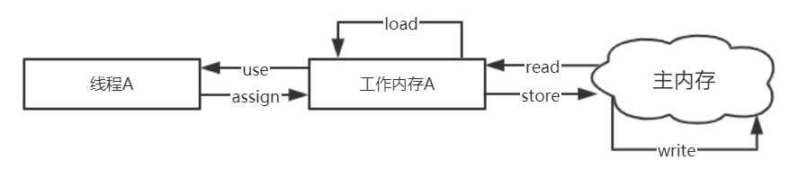
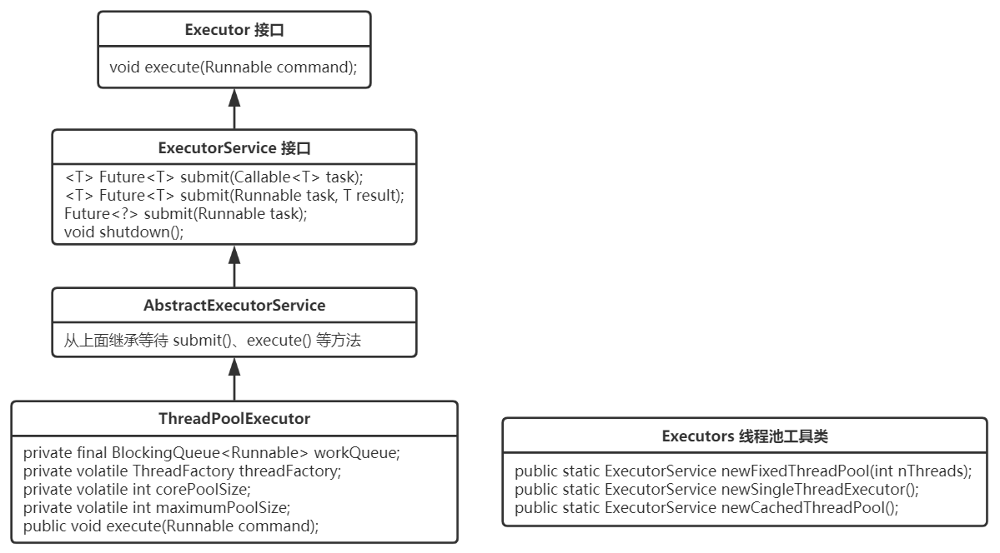

并发编程的第一原则就是不要写并发程序，但现在多核处理器随处可见，所以掌握并发是很有必要的。常见的解决并发问题的模型有**管程**、**信号量**，技术背后的理论和模型往往比技术本身更加重要。Java中的并发大部分都集中在并发包中，而并发包只是针对并发问题开发出来的工具而已，站在理论之上，才能一通百通。

而并发编程往往可以归结为三个问题：**分工**、**互斥**、**同步**。

- 分工：如何高效地拆解任务分配给线程

例如Java SDK 并发包里的 Executor、Fork/Join、Future 本质上都是一种分工方法，除此之外，一些设计模式如生产者 - 消费者、Thread-Per-Message、Worker Thread 模式等都是用来指导你如何分工的。

- 同步：线程之间如何协作运行

一个线程执行完了一个任务，如何通知执行后续任务的线程开工，协作一般是和分工相关的。Java SDK 并发包里的 Executor、Fork/Join、Future 本质上都是分工方法，但同时也能解决线程协作的问题。工作中遇到的线程协作问题，基本上都可以描述为这样的一个问题：**当某个条件不满足时，线程需要等待，当某个条件满足时，线程需要被唤醒执行**。

- 互斥：保证同一时刻只允许一个线程访问共享资源

分工、同步主要强调的是性能，而当多个线程同时访问一个共享变量的时候，可能会导致"**线程安全**"问题。而线程不安全往往是由于**可见性**、**有序性**、**原子性**没有得到保障，因此Java引入了**内存模型**解决了可见性问题、有序性问题；同时利用互斥解决了原子性问题，实现互斥的核心技术就是**锁**，即synchronized及各种Lock。

锁虽然解决了安全问题，但也带来了性能问题，所以为了提高性能，Java采取了**分场景优化**的策略，如ReadWriteLock等；亦或无锁的数据结构，如各种原子类；还可以不共享变量或只允许读，如Thread Local、final、Copy-on-write模式。

锁除了性能问题，还要注意**死锁**问题。


**推荐资料**

《Java并发编程实战》、《Java并发编程的艺术》、《图解Java多线程设计模式》、《操作系统：精髓与设计原理》

http://ifeve.com 、http://www.cs.umd.edu/~pugh/java/memoryModel/

# 基础理论

## 可见性、原子性与有序性

**并发问题产生的原因**

随着CPU、内存、I/O设备的更新，一直存在着一个**核心矛盾**：**三者的速度差异**。而根据木桶理论（一只水桶能装多少水取决于它最短的那块木板），即取决于I/O设备。

为了合理利用CPU的高性能，平衡这三者的速度差异，计算机体系结构、操作系统、编译程序都做出了贡献，主要体现为：

1. CPU 增加了缓存，以均衡与内存的速度差异；
2. 操作系统增加了进程、线程，以分时复用 CPU，进而均衡 CPU 与 I/O 设备的速度差异；
3. 编译程序优化指令执行次序，使得缓存能够得到更加合理地利用。

但这也给并发带来了新的问题，可归结为：**可见性问题**、**原子性问题**、**有序性问题**

**缓存导致的可见性问题**

> 可见性：一个线程对共享变量的修改，另外一个线程能够立刻看到


1. 线程A和B同时开始运行，线程A执行V+1，此时并未写入内存
2. 线程B开始执行，读取到V=0，此时**线程A执行后的V对B不可见**，然后执行V+1
3. 两个线程都将V=1写入内存，与期待的结果2并不同

**线程切换导致的原子性问题**

> 原子性：一个或者多个操作在CPU执行的过程中不会被中断的特性

&emsp;&emsp;早期因为IO速度太慢，于是操作系统发明了多进程的概念，利用多进程**分时复用**切换**时间片**提高了CPU、IO的使用率；不同进程是不共享内存空间的，即进程在切换时需要切换内存映射地址，而进程所创建的所有线程却是都共享同一个内存空间，这样的话任务切换的成本就降低了。

所以任务切换也往往指的是线程切换，在高级语言里，一条语句往往由多条CPU指令组成，而操作系统做任务切换时可能发生在任何**一条CPU**指令前后，故会导致并发问题。


&emsp;&emsp;上图我们创建了两个线程来执行count+1操作，而count+1的CPU指令如下:

1. 首先，需要把变量 count 从内存加载到 CPU 的寄存器；
2. 之后，在寄存器中执行 +1 操作；
3. 最后，将结果写入内存（缓存机制导致可能写入的是 CPU 缓存而不是内存）。

&emsp;&emsp;若按照图中的执行的顺序，则最终结果为1，而不是2。所以我们经常需要在高级语言里来保证操作的原子性从而避免bug的产生。

**编译优化导致的有序性问题**

> 有序性：代码按照代码的先后顺序执行

双重检查创建单例对象案例：

```java
public class Singleton {
  static Singleton instance;
  static Singleton getInstance(){
    if (instance == null) {
      synchronized(Singleton.class) {
        if (instance == null)
          instance = new Singleton();
        }
    }
    return instance;
  }
}
```

&emsp;&emsp;按照常理来看没有问题，但问题往往出现在意向不到的地方，我们以为的new操作应该是：

1. 分配一块内存 M；
2. 在内存 M 上初始化 Singleton 对象；
3. 然后 M 的地址赋值给 instance 变量。

&emsp;&emsp;而实际上编译器对其优化后顺序可能就变为了**1->3->2**，在线程A先执行getInstance()方法，在赋值给instance变量后发生了线程切换；B线程此时进入第一次判断instance不为空，则直接返回，从而可能触发空指针异常,如下图。可通过**volatile**关键字对变量禁止指令重排解决。


&emsp;&emsp;缓存、线程、编译优化都是为了提高程序性能，但同时又带来了新的问题。由此，我们**在采用一项技术的同时，一定要清楚它带来的问题是什么，以及如何规避**。

## Java内存模型

&emsp;&emsp;规范了JVM如何提供按需禁用缓存和编译优化

### Java 内存操作协议

&emsp;&emsp;Java 内存模型定义了 8 种操作来完成主内存和工作内存的变量访问，具体如下：



- read：把一个变量的值从主内存传输到线程的工作内存中，以便随后的 load 动作使用。
- load：把从主内存中读取的变量值载入工作内存的变量副本中。
- use：把工作内存中一个变量的值传递给 Java 虚拟机执行引擎。
- assign：把从执行引擎接收到的变量的值赋值给工作内存中的变量。
- store：把工作内存中一个变量的值传送到主内存中，以便随后的 write 操作。
- write：工作内存传递过来的变量值放入主内存中。
- lock：把主内存的一个变量标识为某个线程独占的状态。
- unlock：把主内存中 一个处于锁定状态的变量释放出来，被释放后的变量才可以被其他线程锁定。

### JMM如何解决原子性、可见性、有序性

1. 原子性
2. 可见性
3. 有序性

&emsp;&emsp;volatile 通过加入内存屏障指令来禁止内存的重排序。synchronized 通过加锁，保证同一时刻只有一个线程来执行同步代码。

## **Lock和Condition**

&emsp;&emsp;并发编程主要是为了解决两大问题

- **互斥**，即同一时刻只允许一个线程访问共享资源--->>>原子性
- **同步**，即线程之间如何通信、协作--->>>可见性、有序性

&emsp;&emsp;Java SDK 并发包通过 Lock 和 Condition 两个接口来实现管程，其中 Lock 用于解决互斥问题，Condition 用于解决同步问题。

**管程是怎么解决互斥与同步的问题的？**

&emsp;&emsp;synchronized是管程的一种默认实现，待补充


**为什么还需要有Lock和Condition呢？**

&emsp;&emsp;synchronized无法**破坏不可抢占**条件，因为synchronized申请资源时，申请不到就会直接进入阻塞状态，这时候也无法释放自身所占有的资源。而我们希望的是当申请不到资源时能够主动释放它占有的资源。

&emsp;&emsp;若需要设计这样一把互斥锁来解决synchronized的问题，也就是能够**破坏不可抢占**条件，有以下三种方式：

1. **能够响应中断**：即阻塞中的线程能够响应中断信息，即能够被唤醒，这样就能释放它所占有的资源
2. **超时机制**：即线程在一段时间内没有获取到锁，不是进入阻塞状态，而是返回一个错误码
3. **非阻塞地获取锁**：若尝试获取锁失败，不进入阻塞状态，而是直接返回

Lock接口的API则用这三种方式完美解决了synchronized的问题

```java
//支持中断
void lockInterruptibly() throws InterruptedException;
//支持超时
boolean tryLock(long time, TimeUnit unit) throws InterruptedException;
//支持非阻塞
boolean tryLock();
```

那synchronized为什么一开始不设计成这样的呢

**Lock如何保证可见性？**  原子性、有序性呢？


**什么是可重入锁？**

&emsp;&emsp;可重入锁：线程可以重复获取同一把锁

&emsp;&emsp;可重入函数：多个线程可以同时调用该函数

**什么是公平锁与非公平锁？**

```java
//无参构造函数：默认非公平锁
public ReentrantLock() {
    sync = new NonfairSync();
}
//根据公平策略参数创建锁
public ReentrantLock(boolean fair){
    sync = fair ? new FairSync() 
                : new NonfairSync();
}
```

&emsp;&emsp;每把锁都对应着一个等待队列，当锁被释放，会去等待队列中唤醒一个线程，若是公平锁，则谁等待的时间长就唤醒谁；若是非公平锁，则随机唤醒。

**用锁的最佳实践**

- 永远只在更新对象的成员变量时加锁
- 永远只在访问可变的成员变量时加锁
- 永远不在调用其他对象的方法时加锁

**Condition**

&emsp;&emsp;待补充

# 并发工具类

# 并发设计模式

# 源码分析

## Thread类

## ThreadLocal类

**注意点**

- ThreadLocal 不是用来解决线程安全问题的，多线程不共享，不存在竞争！其目的是使线程能够使用本地变量。
- 项目如果使用了线程池，那么线程回收后 ThreadLocal 变量要 remove 掉，否则线程池回收线程后，变量还在内存中，可能会带来意想不到的后果！例如 Tomcat 容器的线程池，可以在拦截器中处理：继承 HandlerInterceptorAdapter，然后复写 afterCompletion()方法，remove 掉变量！！！

## ThreadPoolExecutor类



类图补充加上ScheduledExecutorService、ScheduledThreadPoolExecutor

&emsp;&emsp;线程池创建的目的：

&emsp;&emsp;如何设置线程池的核心线程数、最大线程数

**Executor接口**

**ExecutorService接口**

**AbstractExecutorService接口**

**ThradPoolExecutor类**

&emsp;&emsp;主要实现：execute()方法

**Executors工具类**

&emsp;&emsp;适用场景

**BlockQueue**

- ArrayBlockingQueue

&emsp;&emsp;定长数组实现，

- LinkedBlockingQueue

&emsp;&emsp;生产者端和消费者端分别采用了独立的锁来控制数据同步，这也意味着在高并发的情况下生产者和消费者可以并行地操作队列中的数据，以此来提高整个队列的并发性能。

- PriorityBlockingQueue

&emsp;&emsp;生产者生产数据的速度绝对不能快于消费者消费数据的速度，否则时间一长，会最终耗尽所有的可用堆内存空间。在实现 PriorityBlockingQueue 时，内部控制线程同步的锁采用的是公平锁。

## Lock接口

## AQS

1. 管理同步状态
2. 维护同步队列
3. 阻塞和唤醒线程

&emsp;&emsp;AQS 的核心包括：同步队列，独占式锁的获取和释放，共享锁的获取和释放以及可中断锁，超时等待锁获取这些特性的实现，而这些实际上则是 AQS 提供出来的模板方法。


## CountDownLatch类

## CyclicBarrier类

## Semaphore类

## LockSupport类

# Q&A

1. 为什么会有线程安全问题？

2. 锁是如何保证线程安全的？

3. 原子类是如何保证线程安全的？

4. 除了锁，原子类，还有其他的方式保证线程安全吗？

5. Java在操作系统层面做了哪些来保证线程安全？

6. 了解AQS吗？AQS原理及相关实现？

7. 用过哪些线程协作类？  如果有一个批量任务起了一批线程，需要汇总结果可以用什么？  除了这个还有什么？

8. 介绍下线程池，各个参数，拒绝策略，你们是如何设置线程数的？有128个任务并发进来，核心设为8，最大为32，阻塞队列设为20，问线程池此时启动了多少个线程

9. 知道线程的活跃性问题吗？（死锁及四个必要条件，并发包是如何解决的，活锁，饥饿是怎么产生及如何解决的）

10. 守护线程？

    守护线程的应用场景：为其他用户线程服务的功能，如心跳检测、事件监听，最著名的是GC

11. ThreadLocal原理？

12. LockSupport

13. 线程的各种状态以及切换场景？

14. **synchronized的锁升级**

&emsp;&emsp;无锁->偏向锁->轻量级锁->重量级锁
